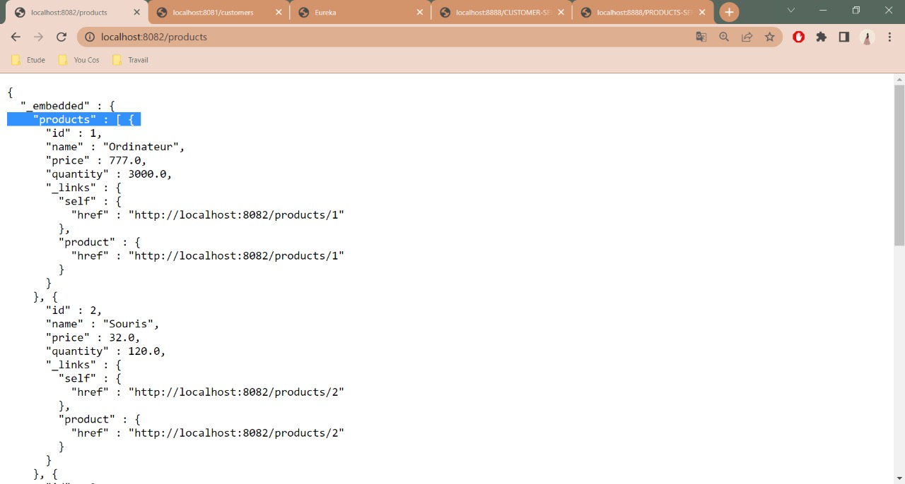
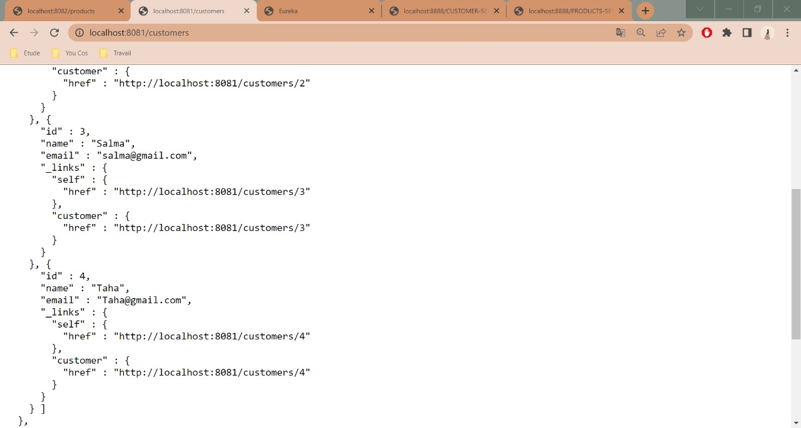
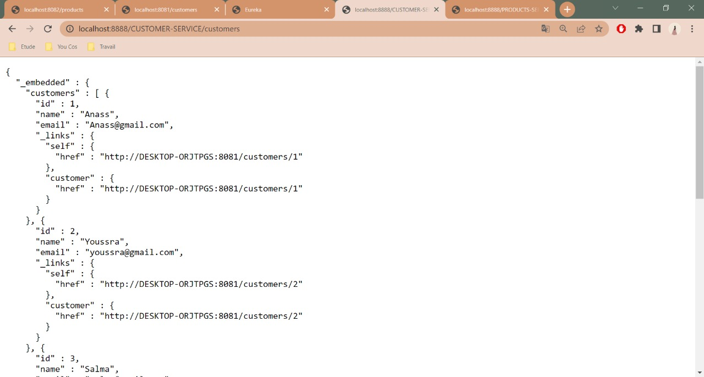

# Application basée sur une architecture micro-service de gestion des factures, produits et clients

Premièrement j'ai commencé par la creation des microservices gestion Clients, produits et facture par la génération en premier lieu du projet spring avec les dépendance depuis le site de Spring, après j'ai procéder vers la création des modèles, controlleurs et repositories (pour synchroniser avec la base de données), et finalement l'application qui lance le projet. Ensuite j'ai dévelopé le service eurekadiscovery pour grouper tout les microservices, par la configuration dynamique de leurs liens et ports. finamelemnt j'ai créer le gateway service qui donne la permission d'utiliser un seule lien/port et swicher entre les microservices par le nom de chacun.

## Screenshots

## License

EMSI
